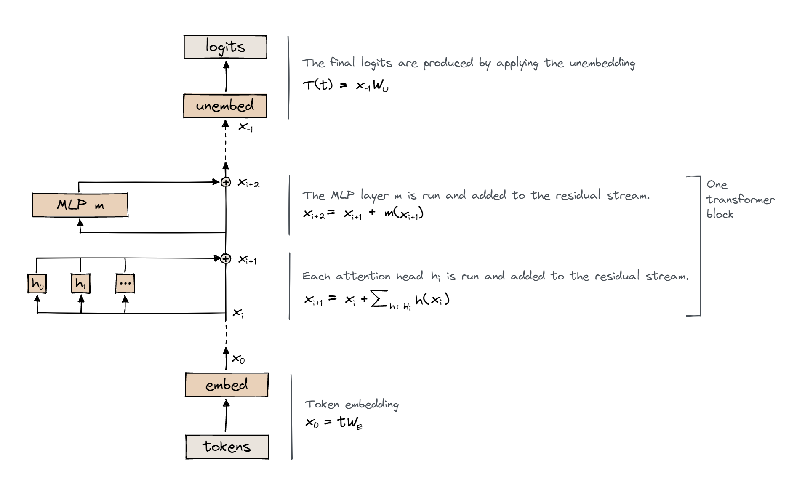
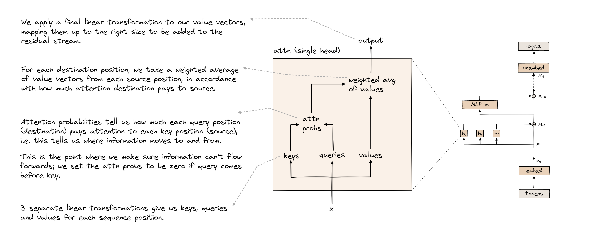

[Adapted from an ETH Homework](https://colab.research.google.com/drive/1SA636edCBVr_pIDstEUuc-f7HMb7FKnp?usp=sharing)

Because this is a group homework, it will be more effort for fewer points (this is because you can split the effort between groups of up to three people).  However, you may not use the exact same group for future homeworks, so choose carefully.

# Implementing a Transformer from Scratch

In this exercise, you will implement key components of the Transformer architecture, a cornerstone in modern natural language processing technology, introduced by the ["Attention is All You Need" paper](https://arxiv.org/abs/1706.03762).

Your task involves coding missing parts within this notebook, which sketches out the structure of a Transformer block. This will include layer normalization, MLP, and attention mechanism. All the pieces you implement will be then put toghether to define an actual Tranformer-based model. Finally, you will load the pre-trained GPT-2 weights into your model and implement a simple decoding function to generate text from it.

## Overview of the Transformer Architecture

In a Tranformer-based model, the input is initially converted into token embeddings. Then it progresses through a set of Transformer blocks consisting of the attention mechanism and feed-forward MLP layer. At each stage, the information is combined with a residual connection, ensuring the flow of both original and processed data throughout the model. Finally, the residual stream is projected back onto the vocabulary space via the unembedding procedure.




The streamlined visualization above omits two important components: layer normalization and positional embeddings.


**Layer Normalization**: Although not depicted, Layer Normalization is a standard procedure applied before each sub-component (MLP, attention layer) and prior to the final logits computation. It normalizes each vector within the batch and position to a mean of zero and variance of one, followed by an element-wise scale and translation.

**Positional Embeddings**: The diagram also excludes the representation of Positional Embeddings. In the absence of such embeddings, attention mechanisms would treat the input as positionally symmetric, neglecting the locality inherent in language where neighboring tokens are often more relevant. To address this, learned, absolute positional embeddings are used, where each token position is mapped to a unique vector and added to the token embeddings, reinforcing the model's awareness of token order. Addition rather than concatenation is the norm within Transformer architectures, conserving dimensionality and accommodating feature superposition within the shared residual stream.

## Setup (no need to read, just run!)

               ./venv/bin/pip3 install -r requirements.txt
			   
			   
## Preliminaries

For each component of the Transformer architecture covered in this exercise, we provide you with a code skeleton that outlines the structure of the component and defines its parameters. Your task is to implement the forward pass of each component. This means you need to define how the parameters are used and combined with the input tensor to produce the output of the component.

### Typing
In the provided code skeleton for the Transformer components, you will notice an explicit typing notation used in the signature of the forward method. This notation serves a dual purpose: it enhances code readability and provides clear expectations for the input and output tensor dimensions. Here's a brief example of this typing:

`Float[Tensor, "batch posn d_model"]`: This notation specifies that the function expects a floating-point tensor with three dimensions. The dimensions are labeled for clarity:
- `batch` represents the size of the batch, or the number of sequences in each input batch.
- `posn` (position) indicates the length of each sequence in the batch.
- `d_model` is the dimensionality of each vector in the sequence, a key parameter in Transformer models representing the size of the embeddings and residual stream.

This explicit typing convention is a guide to help you correctly manipulate tensors, ensuring that your implementation aligns with the expected input and output dimensions.

### Tests

Throughout the exercise, we employ a series of tests to validate the correctness of your implementation of Transformer components.

After you write your code, two tests will verify your solution:
- `rand_float_test`/`rand_float_test` will check the correctness of the output dimensionality of your function.
- `load_gpt2_test` compares the output of your implementation with that of a corresponding component from a pre-trained GPT-2 model to ensure correctness.

## Q1: LayerNorm (2 pts)

This part of the exercise involves implementing Layer Normalization (LayerNorm) within the Transformer architecture. LayerNorm is a technique in deep learning that stabilizes the distribution of the inputs to a layer. It is especially important in Transformers to help control the scale of the outputs across different layers, which in turn aids in faster convergence and improved overall model performance.

In particular, your implementation of LayerNorm should do the following:
- center the residual stream (such that it has mean 0)
- normalize it to have variance 1
- re-scale it according to the learned weights
- add the learned bias

You can refer to the [PyTorch LayerNorm documentation](https://pytorch.org/docs/stable/generated/torch.nn.LayerNorm.html).

Replace the `pass` instruction in the LayerNorm class with your solution.

**Warning:** refrain from using in-place operations (e.g., `x += y`) as they might lead to random test failuers due to small numerical differences.

**Hint:** compute the variance of the residual stream values using `residual.var(..., unbiased=False)`.

**Hint:** the value of $\epsilon$ is `self.cfg.layer_norm_eps`.

## Q2: Embedding (2 pts)

The embedding layer is the entry point of textual data into the Transformer model, where tokens are transformed into dense vectors. This transformation is crucial as it allows the model to work with  continuous representations of words or subwords, setting the stage for subsequent processing by the model's layers.

Your task is to complete the `forward` method of the `Embed` class. This method should map each token in the input sequence to a high-dimensional vector using an embedding matrix.

- **Embedding Matrix**: The class is initialized with an embedding matrix `W_E` of shape `[cfg.d_vocab, cfg.d_model]`, where `cfg.d_vocab` is the size of the vocabulary, and `cfg.d_model` is the dimensionality of the embeddings. This matrix is a learnable parameter of the model.
- **Token to Vector Transformation**: In the `forward` method, your goal is to transform the input tokens into their corresponding vectors based on the embedding matrix. The input tensor `tokens` has a shape of `[batch, position]`, indicating a batch of token sequences.
- **Output**: The output of the `forward` method should be a tensor of shape `[batch, position, d_model]`, where each token has been replaced by its corresponding vector from the embedding matrix. This tensor represents the embedded input sequences and serves as the input to subsequent layers of the Transformer model.

In simple words, what you need to implement is a lookup table from tokens to residual stream vectors.

**Hint:** you can implement this in just one line, without any complicated functions.

## Q3: Positional Embeddings (2 pts)

Unlike traditional sequence models that inherently process sequences in a certain order (e.g., RNNs), Transformers treat input sequences as sets of tokens, requiring an explicit mechanism to incorporate positional information. Positional embeddings serve this function.

Positional embedding functions similarly to a lookup table, with the crucial difference that the lookup indices correspond to `0`, `1`, `2`, ..., `seq_len-1`, representing the positional indices of tokens within a sequence, instead of token IDs. This approach encodes the position of each token in the sequence, distinguishing their order.

- **Positional Embedding Matrix**: Upon initialization, `PosEmbed` creates a positional embedding matrix `W_pos` of shape `[cfg.n_ctx, cfg.d_model]`, where `cfg.n_ctx` is the maximum sequence length the model can handle, and `cfg.d_model` is the dimensionality of the embeddings. This matrix is a learnable parameter and contains a unique vector for each position in a sequence.
- **Return Positional Information**: In the `forward` method, your goal is to return the positional embeddings to the input token embeddings. Given an input tensor `tokens` with shape `[batch, position]`, you need to map each position index in the sequences to its corresponding positional embedding vector, resulting in a tensor of shape `[batch, position, d_model]`.

## Question 4: Attention (6 pts)

The Attention mechanism is the fundamental component of the Transformer architecture, allowing the model to focus on different parts of the input sequence when performing tasks. In this section, you will implement a multi-head self-attention mechanism. The computation that this module should carry out is the following.

**Step 1: Produce an Attention Pattern**
- **Linear Mapping**: Transform the input tensor `normalized_resid_pre` into queries, keys, and values using the parameters `W_Q`, `W_K`, `W_V`, and their corresponding biases. Each of these tensors should have the shape `[batch, seq_posn, head_index, d_head]`.
- **Dot Product & Scaling**: Compute the dot product between every pair of queries and keys to obtain `attn_scores` with shape `[batch, head_index, query_pos, key_pos]`. Scale the `attn_scores` by $1/\sqrt{d_{head}}$ to stabilize gradients.
- **Causal Masking**: Apply the causal mask to `attn_scores` using the `apply_causal_mask` method. This step ensures the model cannot attend to future tokens, making the attention scores lower triangular.
- **Softmax**: Apply the softmax function along the `key_pos` dimension to obtain a normalized attention pattern. This pattern indicates the importance of each key to each query.

**Step 2: Aggregate Information Using the Attention Pattern**
- **Value Mapping**: Use the linear mapping to transform the input into value vectors.
- **Weighted Sum**: Multiply the attention pattern by the value vectors to obtain `z`, a weighted sum that represents a gathering of information from source tokens to each destination token.
- **Output Mapping**: Finally, combine the results across all heads and map them back to the original dimension (`d_model`) using `W_O` and `b_O`. This produces the output tensor of the attention mechanism, maintaining the shape `[batch, position, d_model]`.



In this section, we will use the [Einstein notation](https://en.wikipedia.org/wiki/Einstein_notation) to define matrix multiplications. In particular, we will use the `einsum` function from the `einops` module ([link to docs](https://einops.rocks/api/einsum/)). This way, we can specify how we want to perform a multiplication between two matrices $A \in \mathbb{R}^{n\times m}$ and $B \in \mathbb{R}^{m\times k}$ in the following way:
```
einops.einsum(a, b, 'n m, m k -> n k')
```

Your task is to fill in the multiplication specifications within the einsum function calls. Replace the placeholder strings `[fill in pattern here]` with the correct dimensionality of the matrices involved, following the pattern `dimA1 dimA2..., dimB1, dimB2... -> dimRes1 dimRes2...`.


## Question 5: MLP (4 pts)

The Multi-Layer Perceptron (MLP) is a core component of the Transformer architecture, functioning as a powerful mechanism for capturing complex relationships in the data. Within a Transformer block, the MLP typically takes as input the sum of the residual stream and the output of the attention mechanism.
The MLP in a Transformer consists of two linear layers separated by a non-linear activation function.

Complete the `forward` method of the `MLP` class. The method receives an input tensor `normalized_resid_mid` with dimensions `[batch, posn, d_model]`, and needs to perform the following steps:
1. Apply the first linear transformation using `self.W_in` and `self.b_in` to the input tensor. This step increases the dimensionality from `d_model` to `d_mlp`.
2. Apply a non-linear activation function (GELU, the function `gelu_new` has been imported for this purpose) to the output of step 1.
3. Apply the second linear transformation using `self.W_out` and `self.b_out` to the result of step 2, reducing the dimensionality back to `d_model`.

**Hint:** here you can implement matrix multiplications using `torch.matmul(tensor1, tensor2)` or the equivalent `tensor1 @ tensor2` notation ([docs](https://pytorch.org/docs/stable/generated/torch.matmul.html)).

## Q6: Transformer Block (2 pts)

Now, we can put together the attention, MLP and layernorms into a single transformer block.

**Warning:** refrain from using in-place operations (e.g., `x += y`) as they might lead to random test failuers due to small numerical differences.

## Q7: Unembedding (2 pts)


The unembedding layer transforms the dense vectors back into discrete token representations, effectively reversing the embedding process.
In the `forward` method, apply a linear transformation to the input tensor `normalized_resid_final` using `W_U` and `b_U`, converting the model's internal representations into logits over the vocabulary.

## Q8: Full Transformer-based Model (3 pts)

This section describes the assembly of a complete Transformer-based model, integrating various components you've previously implemented.
The `DemoTransformer` class encapsulates the entire model architecture, starting from input token embeddings, adding positional information, processing through multiple Transformer blocks, and finally converting the processed embeddings back into logits over the vocabulary. Your task is to arrange these components within the model's `forward` method.

Hint: you can use a loop over `range(cfg.n_layers)`.

## Q9: Generating Text From a Transformer (Extra Credit - 5 pts)

After assembling and validating the `DemoTransformer` model against the GPT-2 reference architecture, the next step is to bring your model to life by generating text. This section focuses on leveraging the weights of the pre-trained GPT-2 Small model to produce text, emphasizing the application of greedy decoding.

**Loading Pre-trained Weights**

Start by loading the pre-trained GPT-2 Small weights into your `DemoTransformer` model with the following code:

     demo_gpt2 = DemoTransformer(Config(debug=False)).to(device)
     demo_gpt2.load_state_dict(reference_gpt2.state_dict(), strict=False)


**Greedy Decoding**

Greedy decoding is a straightforward approach to text generation where, at each step, the model selects the word with the highest probability as its next output.
In this final section of the exercise, you will leverage the pre-trained GPT-2 Small model within your Transformer classes to generate text.
You are tasked with implementing a function named `greedy_decode` that generates text from an initial sequence of tokens. This function will utilize greedy decoding, selecting the most probable next token at each step.

- **Function Parameters:**
  - `model`: Your initialized and pre-trained `DemoTransformer` model.
  - `start_tokens`: A list of token IDs (integers) representing the initial sequence from which to start generating text.
  - `max_length`: The maximum total number of tokens to generate, including the initial sequence.

- **Decoding Logic:**
  - The function should begin with the provided `start_tokens` and iteratively generate additional tokens, appending each new token to the sequence.
  - At each step, the function selects the token with the highest probability as the next addition to the sequence.
  - Generation continues until either the `max_length` is reached or an end-of-sequence token is generated.

- **Return Value:**
  - The function should return a list of token IDs, representing the generated sequence including the initial tokens.

  **Hint:** use `tensor.argmax()` to get the token_id with highest logit/probability.

  **Hint:** use `tensor1 = torch.cat((tensor1, tensor2))` to append `tensor2` to `tensor1`.
